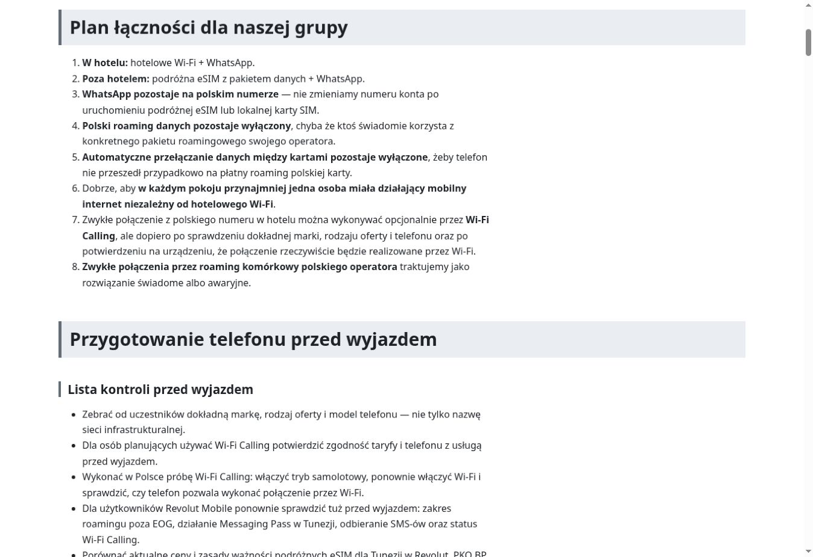

# Audyt szerokości treści i nagłówków

Status: **analiza zakończona 24 sierpnia 2026 r.; zmiana szerokości strony nie została jeszcze wdrożona**.

Ten dokument zapisuje ocenę obecnego układu strony na komputerach. Problem jest wcześniejszą cechą jasnego układu i nie wynika z wdrożenia trybu ciemnego.

## Obecne rozwiązanie

- wspólny kontener `.wrapper` ma maksymalną szerokość `72rem`, czyli 1152 px;
- akapity i elementy list mają `max-width: 75ch`, co w sprawdzonym widoku dawało około 686 px;
- nagłówki H2 zajmują pełną szerokość kontenera i mają tło na całą tę szerokość;
- nagłówki mogą się normalnie zawijać, a `overflow-wrap: anywhere` zabezpiecza również przed przepełnieniem przez bardzo długi ciąg znaków;
- na urządzeniach mobilnych szerokość kontenera jest ograniczona szerokością ekranu, dlatego opisany nadmiar pustej przestrzeni dotyczy przede wszystkim komputerów.

## Wynik oględzin

Przy szerokości okna około 1360 px kontener treści ma 1152 px, natomiast zwykły tekst wykorzystuje około 60% jego szerokości. Po prawej stronie akapitów i list pozostaje zwykle około 426–466 px wolnego miejsca.

Ten sam układ występuje na różnych podstronach, między innymi w działach Praktyczne, Zdrowie, Pieniądze i Wycieczki. Nie jest to więc problem pojedynczej strony.

Przejrzano także wszystkie publiczne nagłówki H2. Najdłuższy z nich — „Bezpieczeństwo, ubezpieczenie i odpowiedzialność przed zakupem wycieczki” — już przy obecnej szerokości zajmuje dwie linie. Po ewentualnym zwężeniu kontenera kilka innych długich nagłówków również przejdzie do dwóch linii. Ich tło nadal pozostanie na pełną szerokość kontenera.

## Rekomendacja

Zachować jeden spójny układ dla całego serwisu i zmniejszyć maksymalną szerokość wspólnego kontenera z `72rem` do około `60rem`.

Zmiana powinna objąć jednocześnie nagłówek strony, nawigację, treść główną i stopkę. Nie należy wprowadzać osobnych szerokości dla wybranych podstron ani wyjątków dla długich nagłówków.

Bez zmian powinny pozostać:

- wyrównanie tekstu do lewej;
- limit `75ch` dla akapitów i list;
- pełna szerokość tła H2 wewnątrz kontenera;
- automatyczne zawijanie tekstu nagłówków;
- typografia, kolory, hierarchia i odstępy;
- oba warianty kolorystyczne strony.

Wartość `60rem` jest rekomendowanym punktem do próby, a nie jeszcze zatwierdzoną zmianą produkcyjną. Przed wdrożeniem trzeba porównać widoki strony głównej, długiej podstrony i mapy.

## Materiał porównawczy

Poniższy zrzut przedstawia obecny wygląd działu Łączność na komputerze przed zmianą szerokości:

## Lista kontroli

- [x] odczytanie aktualnych reguł szerokości w CSS;
- [x] wizualne sprawdzenie strony na komputerze;
- [x] pomiar szerokości kontenera, akapitów i wolnej przestrzeni;
- [x] porównanie układu na kilku publicznych podstronach;
- [x] sprawdzenie wszystkich publicznych nagłówków H2, w tym najdłuższych;
- [x] potwierdzenie, że rozwiązanie powinno być wspólne dla całego serwisu;
- [ ] próbna zmiana szerokości kontenera na `60rem`;
- [ ] wykonanie zrzutów porównawczych po zmianie;
- [ ] kontrola strony głównej, mapy i długich nagłówków na komputerze;
- [ ] kontrola układu mobilnego i powiększenia przed wdrożeniem.
