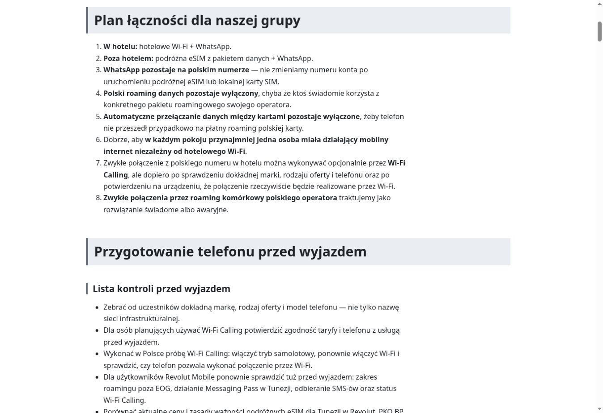
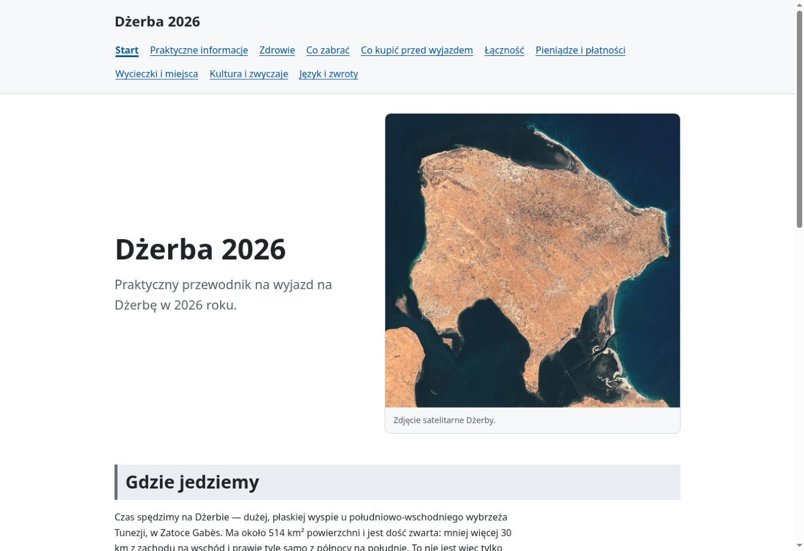
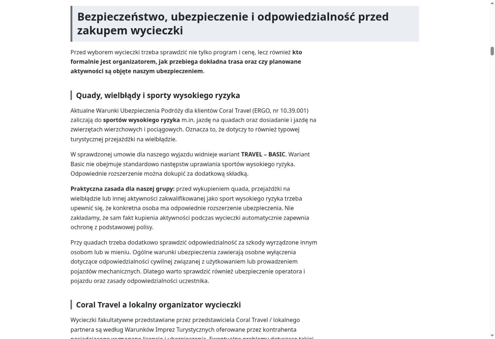
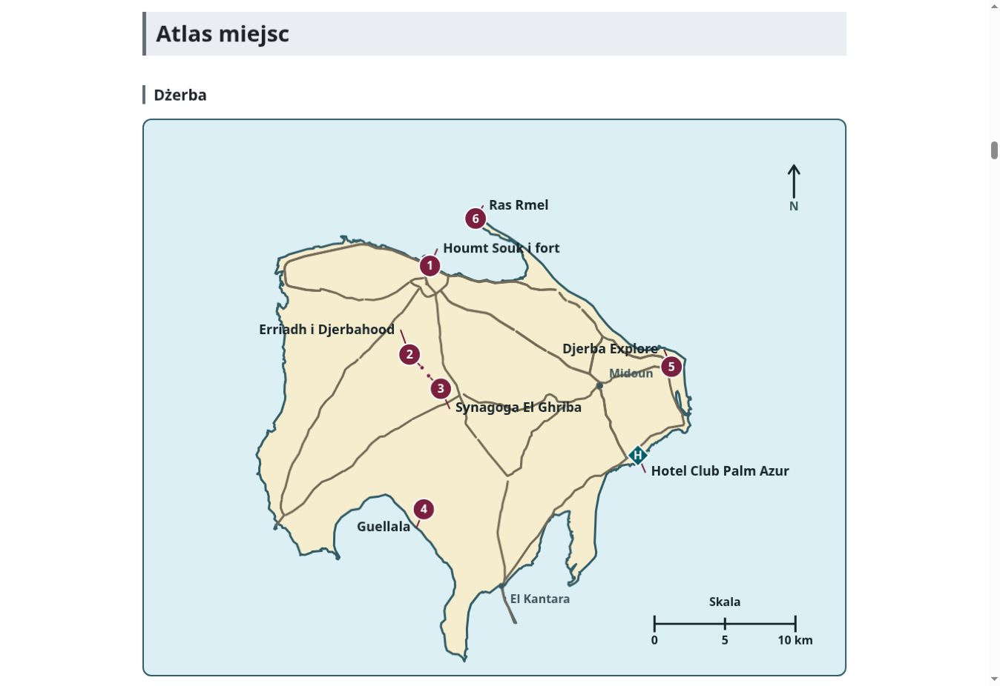

# Audyt szerokości treści i nagłówków

Status: **zmiana wdrożona i opublikowana 24 sierpnia 2026 r.; kontrola komputerowa zakończona pozytywnie, ręczny test na docelowym urządzeniu mobilnym i przy powiększeniu pozostaje do wykonania**.

Commit wdrażający zmianę: `ba28daf2d82169d3aeb202b7004c34d2d5000f10`.

Ten dokument zapisuje ocenę obecnego układu strony na komputerach. Problem jest wcześniejszą cechą jasnego układu i nie wynika z wdrożenia trybu ciemnego.

## Stan przed zmianą

- wspólny kontener `.wrapper` ma maksymalną szerokość `72rem`, czyli 1152 px;
- akapity i elementy list mają `max-width: 75ch`, co w sprawdzonym widoku dawało około 686 px;
- nagłówki H2 zajmują pełną szerokość kontenera i mają tło na całą tę szerokość;
- nagłówki mogą się normalnie zawijać, a `overflow-wrap: anywhere` zabezpiecza również przed przepełnieniem przez bardzo długi ciąg znaków;
- na urządzeniach mobilnych szerokość kontenera jest ograniczona szerokością ekranu, dlatego opisany nadmiar pustej przestrzeni dotyczy przede wszystkim komputerów.

## Wynik oględzin

Przy szerokości okna około 1360 px kontener treści ma 1152 px, natomiast zwykły tekst wykorzystuje około 60% jego szerokości. Po prawej stronie akapitów i list pozostaje zwykle około 426–466 px wolnego miejsca.

Ten sam układ występuje na różnych podstronach, między innymi w działach Praktyczne, Zdrowie, Pieniądze i Wycieczki. Nie jest to więc problem pojedynczej strony.

Przejrzano także wszystkie publiczne nagłówki H2. Najdłuższy z nich — „Bezpieczeństwo, ubezpieczenie i odpowiedzialność przed zakupem wycieczki” — już przy ówczesnej szerokości zajmował dwie linie. Przewidywano, że po zwężeniu kontenera kilka innych długich nagłówków również przejdzie do dwóch linii, a ich tło pozostanie na pełną szerokość kontenera.

## Przyjęte rozwiązanie

Zachowano jeden spójny układ dla całego serwisu i zmniejszono maksymalną szerokość wspólnego kontenera z `72rem` do `60rem`.

Zmiana obejmuje jednocześnie nagłówek strony, nawigację, treść główną i stopkę. Nie wprowadzono osobnych szerokości dla wybranych podstron ani wyjątków dla długich nagłówków.

Bez zmian powinny pozostać:

- wyrównanie tekstu do lewej;
- limit `75ch` dla akapitów i list;
- pełna szerokość tła H2 wewnątrz kontenera;
- automatyczne zawijanie tekstu nagłówków;
- typografia, kolory, hierarchia i odstępy;
- oba warianty kolorystyczne strony.

Zmiana produkcyjna obejmuje tylko dwie wartości w `assets/css/style.css`: podstawową regułę `.wrapper` oraz jej odpowiednik w zapytaniu dla ekranów do `40rem`. Nie zmieniono treści, typografii, kolorów, komponentów ani limitu `75ch`.

## Wynik po wdrożeniu

Przy szerokości okna około 1360 px wspólny kontener ma teraz 960 px. Zwykły tekst nadal ma około 686 px, ale zaczyna się bliżej środka ekranu, a wolne miejsce wewnątrz kontenera po jego prawej stronie zmniejszyło się do około 274 px.

Sprawdzono wszystkie 10 publicznych stron przewodnika. Na każdej:

- wspólny kontener miał 960 px;
- nie wystąpiło poziome przepełnienie całej strony;
- nawigacja zachowała czytelny, zawijany układ;
- tła H2 zachowały pełną szerokość kontenera.

Po zmianie do dwóch linii zawijają się pojedyncze dłuższe H2 w działach Praktyczne, Zdrowie, Wycieczki oraz Język i zwroty. Żaden z nich nie przechodzi do trzech linii w sprawdzonym widoku komputerowym.

Strona główna zachowała dwukolumnowy układ otwarcia. Mapa Dżerby mieści się w kontenerze bez poziomego przewijania na komputerze. Na ekranach do `40rem` wynik szerokości pozostaje taki sam jak wcześniej, ponieważ o rozmiarze kontenera nadal decyduje szerokość ekranu pomniejszona o `1.25rem`, a nie limit `60rem`.

Zmiana szerokości jest niezależna od palety kolorów, więc dotyczy identycznie zatwierdzonego trybu jasnego i wdrożonego trybu ciemnego.

## Materiał porównawczy

Poniższy zrzut przedstawia wygląd działu Łączność na komputerze przed zmianą szerokości:

Ten sam fragment po zmianie:

Dodatkowe kontrolne widoki po zmianie:

## Kontrola publikacji

- workflow `pages build and deployment`, run `32696784058` — `success`;
- publiczny arkusz CSS zawiera obie wartości `60rem`;
- SHA-256 lokalnego i publicznego arkusza CSS jest identyczne: `4456491ff4f5a578d2e3a1eca66df0e28e033cb13728738589a451bfa063a357`;
- workflow `Check links`, run `32696785166`, nie przeszedł w dwóch próbach wyłącznie z powodu zerwania połączenia lub wyzwania WAF serwisu EUR-Lex dla istniejącego odsyłacza w `praktyczne.md`; nie jest to błąd wywołany zmianą szerokości.

## Lista kontroli

- [x] odczytanie aktualnych reguł szerokości w CSS;
- [x] wizualne sprawdzenie strony na komputerze;
- [x] pomiar szerokości kontenera, akapitów i wolnej przestrzeni;
- [x] porównanie układu na kilku publicznych podstronach;
- [x] sprawdzenie wszystkich publicznych nagłówków H2, w tym najdłuższych;
- [x] potwierdzenie, że rozwiązanie powinno być wspólne dla całego serwisu;
- [x] zmiana szerokości kontenera na `60rem`;
- [x] wykonanie zrzutów porównawczych po zmianie;
- [x] kontrola wszystkich 10 publicznych stron pod kątem poziomego przepełnienia;
- [x] kontrola strony głównej, mapy i długich nagłówków na komputerze;
- [x] statyczne potwierdzenie braku zmiany szerokości na ekranach do `40rem`;
- [ ] ręczna kontrola na docelowym urządzeniu mobilnym;
- [ ] ręczna kontrola przy powiększeniu 200% i 400%.
